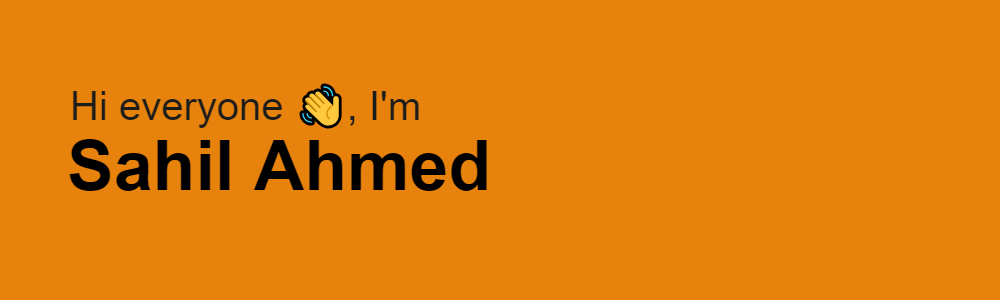

<h2 align="left">  </h2>

---

---

    

              

---
 
<h2 align="center">🔥 A passionate Software Developer from India, IN 🔥</h2>

🔭 I’m currently working on <strong>Full Stack Development</strong>

🌱 I’m currently learning <strong>Node.js, Express.js</strong>

👯 I’m looking to collaborate on <strong>real life industry problems</strong>

👨‍💻 All of my projects are available at <a href="https://sahil-ahmed-devlab.vercel.app/" target="_blank">Portfolio</a>

💬 Ask me about <strong>React.js, Next.js, Node.js</strong>

📫 How to reach me <strong>sahilahmed466@gmail.com</strong>

📄 Know about my experiences <a href="https://drive.google.com/file/d/1tIVSUotSDTObSh_rZcb9-fePVnhyThRF/view?usp=sharing" target="_blank">Resume</a>

⚡ Fun fact <strong>I love watching Anime</strong>

---

<h2 align="center">🔗 Connect with me 🔗</h2>

  
  

---

<h2 align="center">⚒️ Languages and Tools ⚒️</h2>

    <kbd align="center">
    

  

</kbd>

---

<h2 align="center">🐍 My Contribution 🐍</h2>

    

---

<h2 align="center">⚡ My Stats ⚡</h2>

     

    

---
